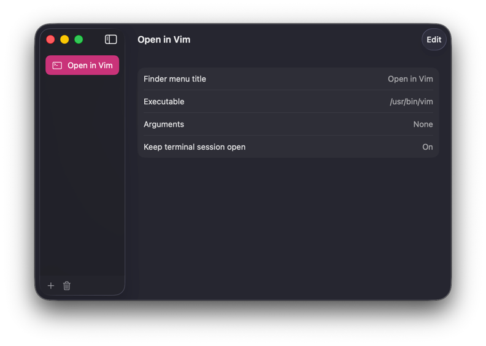
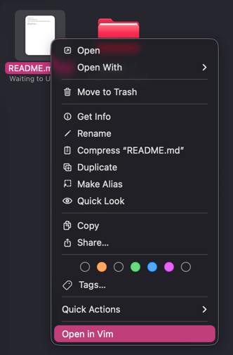

# f2t — Finder to Terminal

[](https://github.com/fopwoc/finder2terminal/actions/workflows/ci.yml)

f2t is a small native macOS app for creating Finder Quick Actions that open
selected files or folders in Terminal.app with Vim, another terminal editor, or
any CLI tool.

Profiles define a Finder menu title, executable, optional arguments, and whether
Terminal should keep the shell open after the command exits. Finder workflows
only pass the profile ID and current selection back to f2t, so profile changes
take effect without rebuilding the workflow.




## Install

```sh
brew tap fopwoc/tap
brew install --cask f2t
```

## Profiles

Each profile supports:

- a Finder menu title;
- an executable path or command;
- arguments, entered one per line;
- keeping the Terminal session open in the selected directory after the tool
  exits.

Deleting a profile also removes its Finder workflow and temporary command
script. Before uninstalling, choose **Delete All f2t Data…** from the app menu
to remove every f2t workflow, script, profile, and saved setting.

## Build

Requires macOS 26.5 and Xcode 26.5 or newer.

```sh
xcodebuild \
  -project finder2terminal.xcodeproj \
  -scheme finder2terminal \
  -configuration Release \
  -destination "generic/platform=macOS" \
  CODE_SIGNING_ALLOWED=NO \
  build
```
