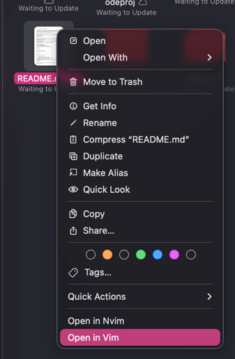
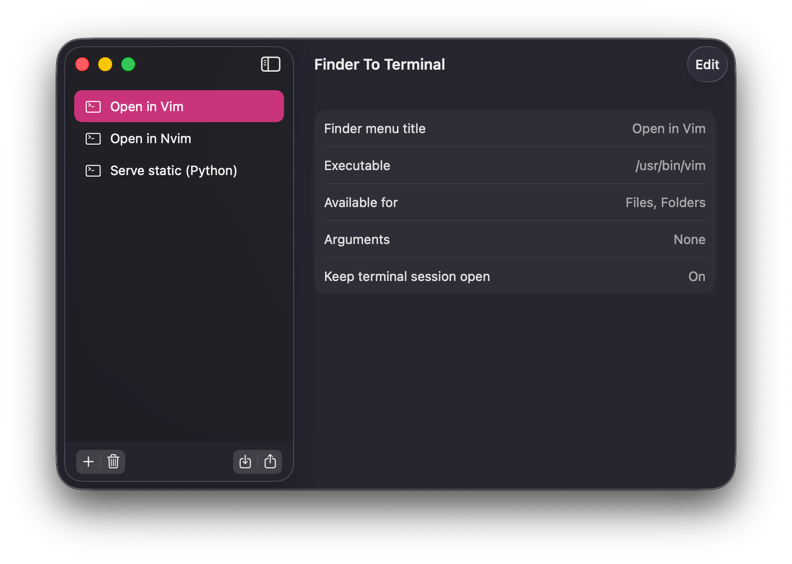
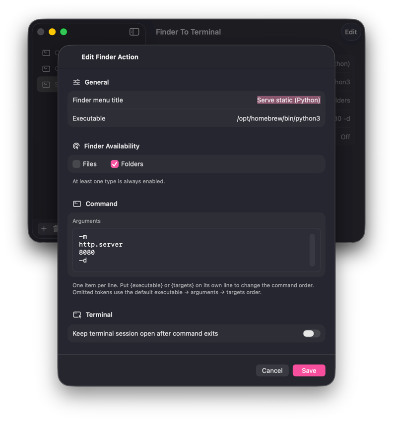

# f2t — Finder to Terminal

[](https://github.com/fopwoc/finder2terminal/actions/workflows/ci.yml)

f2t is a small native macOS app for creating Finder Quick Actions that open
selected files or folders in Terminal.app with Vim, another terminal editor, or
any CLI tool.

Profiles define a Finder menu title, executable, optional arguments, and whether
Terminal should keep the shell open after the command exits. Finder workflows
only pass the profile ID and current selection back to f2t, so profile changes
take effect without rebuilding the workflow.



| Main screen                   | Profile edit                  |
|-------------------------------|-------------------------------|
|  |  |

## Install

```sh
brew tap fopwoc/tap
brew install --cask f2t
```

## Profiles

Each profile supports:

- a Finder menu title;
- an executable path or command;
- availability for files, folders, or both;
- arguments, entered one per line;
- keeping the Terminal session open in the selected directory after the tool
  exits.

Arguments normally run in this order: executable, arguments, selected Finder
targets. Put `{executable}` or `{targets}` on its own argument line to move that
part of the command. For example, an environment-prefixed command can use:

```text
/usr/bin/env
MODE=shared
{executable}
{targets}
```

If either token is omitted, f2t inserts it in its normal position.

Use the import and export controls below the profile list to share one selected
profile as JSON. Import keeps every other profile unchanged. It adds the shared
profile when its UUID is new, or replaces that exact profile when its UUID
already exists.

Few profile examples [here](./example).

## Uninstall

Deleting a profile also removes its Finder workflow and temporary command
script. Before uninstalling, choose **Delete All Data…** from the app menu
to remove every workflow, script, profile, and saved setting.

## Build

Requires macOS 26.5 and Xcode 26.5 or newer.

```sh
xcodebuild \
  -project finder2terminal.xcodeproj \
  -scheme finder2terminal \
  -configuration Release \
  -destination "generic/platform=macOS" \
  CODE_SIGNING_ALLOWED=NO \
  build
```
## Other terminals support

Well, i don't use any other terminal app but default one, but if you want to contribute support for other terminals - feel free do to that. Or just fork it.
